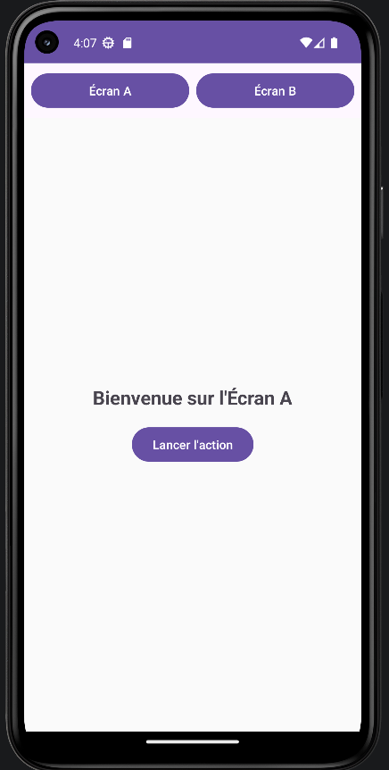
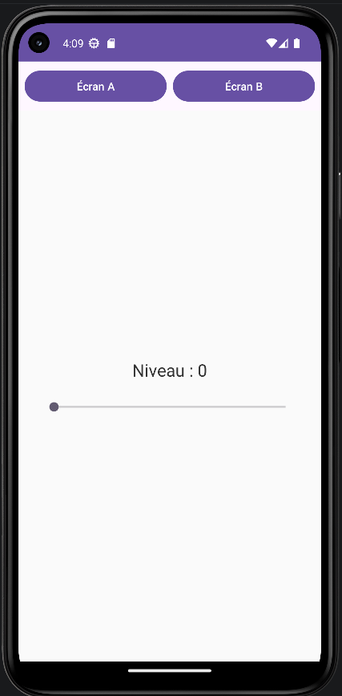

# LAB 4 - Gestion des Fragments et Cycle de Vie


## À propos du projet
Ce projet représente le quatrième laboratoire de mon apprentissage en **Programmation Mobile : Android avec Java**. 

L'objectif majeur de cette application est d'introduire l'architecture modulaire basée sur les **Fragments**. Contrairement au projet précédent qui multipliait les Activités pour chaque vue, ce projet démontre comment créer une application à page unique (Single-Activity) où différentes sous-sections (Fragments) sont chargées et remplacées dynamiquement dans un espace dédié.

## Fonctionnalités
L'application est scindée en deux vues interactives injectées dans une activité principale :
1. **Écran A (FirstFragment) :** Un écran d'accueil simple démontrant l'interaction basique au sein d'un fragment. Il contient un bouton permettant de mettre à jour un message textuel lors du clic.
2. **Écran B (SecondFragment) :** Un écran plus avancé introduisant une barre de défilement (`SeekBar`). Il met à jour un compteur de "Niveau" en temps réel. Cet écran intègre également un mécanisme de sauvegarde d'état pour conserver la valeur de la jauge même si l'utilisateur fait pivoter son téléphone.

## Aperçu
 

## Concepts techniques abordés
Ce laboratoire m'a permis d'assimiler des concepts fondamentaux du système Android :
* **Les Fragments & FragmentManager :** Utilisation du `SupportFragmentManager` et des `FragmentTransaction` (`replace()`, `commit()`) pour permuter dynamiquement les vues XML.
* **Le BackStack (Historique) :** Utilisation de la méthode `addToBackStack()` pour lier la navigation des fragments au bouton "Retour" matériel du téléphone, évitant ainsi de quitter l'application par erreur.
* **Le Cycle de Vie (Lifecycle) :** Compréhension des états de visibilité d'un écran via la surcharge des méthodes `onResume()` et `onPause()`, observées grâce aux journaux de débogage (`Log.d`).
* **Sauvegarde et Restauration d'État :** Utilisation de `onSaveInstanceState` et de l'objet `Bundle` (`savedInstanceState`) pour persister les données de l'interface (comme la progression du curseur) lors de la destruction et recréation de l'Activité (ex: rotation de l'écran).
* **Écouteurs d'événements complexes :** Implémentation de l'interface `OnSeekBarChangeListener` pour capturer les interactions continues de l'utilisateur.

## Comment lancer le projet en local

1. Clonez ce dépôt sur votre machine locale :
   ```bash
   git clone https://github.com/Sultan-zd/Lab4-Fragments.git
   
2. Ouvrez Android Studio.

3. Sélectionnez File > Open et choisissez le dossier du projet cloné.

4. Laissez Gradle synchroniser les dépendances.

5. Cliquez sur le bouton Run (le triangle vert) pour lancer l'application sur un émulateur ou un appareil physique.
